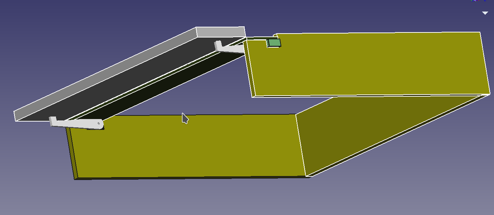
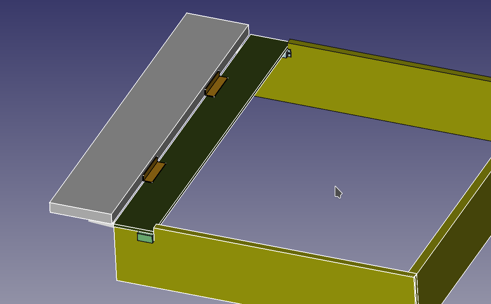
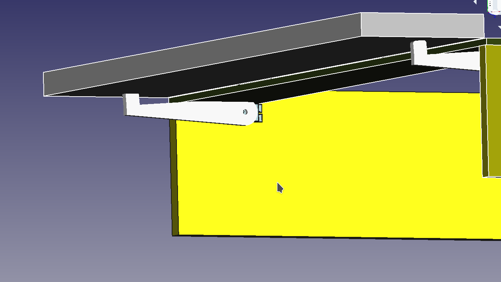
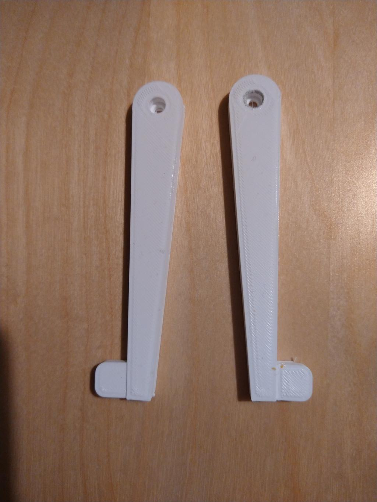
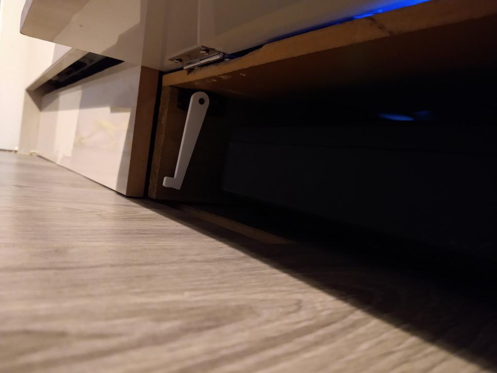

# Smart garage for smart vacuum

### Sumary
Due the lack of space in my house I had to find a new place keep my Neato D5 smart vacuum cleaner. It's been decided - under the kitchen cabinets! 

### Components used
* Home assistant as brain and automation
* esp8266 (Wemos D1 mini) as cotroler 
* Servos x2 - mg996r
* 3d printed servo arms (stl included)
* recycled wood
* hinges
* screws and wires

### 3D model of the garage

### 3D printed servo arms (higher quality posible)

### Live demo

